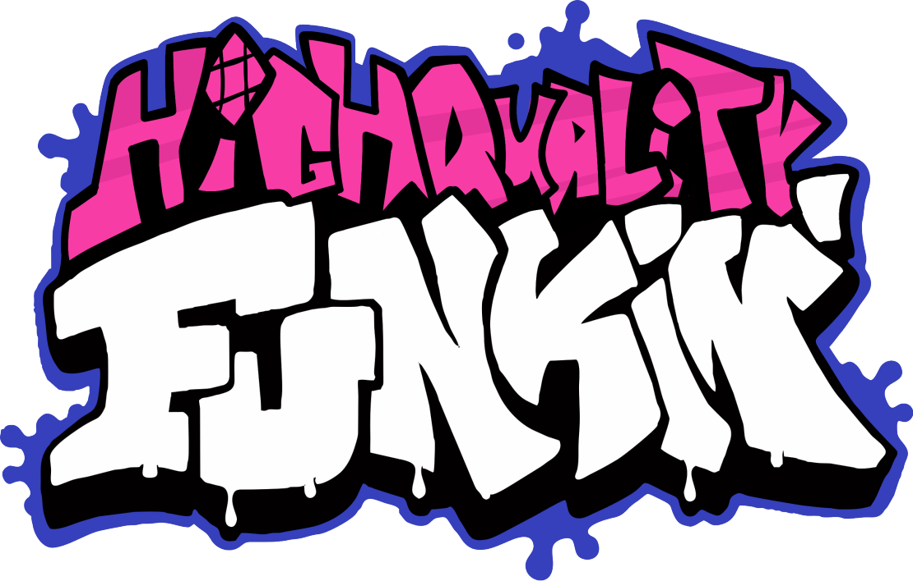
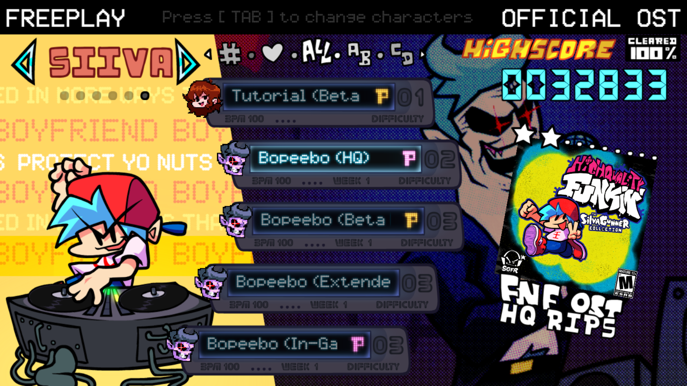

<h2>The SiivaGunner Collection is a mod for Friday Night Funkin' that brings all SiivaGunner rips to base game</h2>

This mod was made with love for SiivaGunner and their community

- [Friday Night Funkin' (PC)](https://ninja-muffin24.itch.io/funkin)
- [Friday Night Funkin' (Android)](https://play.google.com/store/apps/details?id=me.funkin.fnf)
- [Friday Night Funkin' (iOS)](https://apps.apple.com/app/id6740428530)

<table>
  <tr>
    <td></td>
    <td></td>
  </tr>
</table>

# Contributing

Feel free to port any songs that aren't ported yet and open a [Pull Request](https://github.com/ComedyLost/The-Siivagunner-Collection/pulls)

# Current Playable Song List
### Tutorial (COMPLETED)
- Tutorial (COMPLETED)
    - [HQ](https://www.youtube.com/watch?v=tXa3VSCI2NI)
    - [Beta Mix](https://www.youtube.com/watch?v=FtxljDP1QZ8)

### Week 1
- Bopeebo (COMPLETED)
    - [HQ](https://www.youtube.com/watch?v=Kwc88Hvr95c)
    - [Beta Mix](https://www.youtube.com/watch?v=WuSm7-5CMa4)
    - [Extended Version](https://www.youtube.com/watch?v=XMfHwli9hMA)
    - [In-Game Version](https://www.youtube.com/watch?v=xAaxZwAKgTI)
    - [Itch.io Build](https://www.youtube.com/watch?v=19iaq04zV3c)
    - [Newgrounds Build](https://www.youtube.com/watch?v=SLqQAgJ8OOU)
    - [OST Version](https://www.youtube.com/watch?v=39OjZqPV5ME)
    - [Short Version](https://www.youtube.com/watch?v=sosCyTslBIs)
    - [Weekend 1 Update](https://www.youtube.com/watch?v=7sWWN6_U2SI)
    - [Pico Mix](https://www.youtube.com/watch?v=k5EbB5552x4)
- Fresh
    - [HQ](https://www.youtube.com/watch?v=IwFtWJ8miG8)
    - [Alternative Mix](https://www.youtube.com/watch?v=vVmZqoHKIkk)
    - [Vinyl Mix](https://www.youtube.com/watch?v=98Mf-1JVdJs)
    - [Pico Mix](https://www.youtube.com/watch?v=YFUf-BBOa60)
- DadBattle
    - [HQ](https://www.youtube.com/watch?v=mz8vkDckGXg)
    - [In-Game Version](https://www.youtube.com/watch?v=2d0U8RHH3-E) ([In-Game Mix](https://www.youtube.com/watch?v=MeLgnp4ki5s) on March 31st)
    - [Ambient Mix](https://www.youtube.com/watch?v=XASbnC3E4pA) (Unused Aquarium Park Rip)

### Week 2
- Spookeez
    - [HQ](https://www.youtube.com/watch?v=9OGj1pdBLm0)
    - [Beta Mix](https://www.youtube.com/watch?v=UeKB3pwynQA)
- South (COMPLETED)
    - [HQ](https://www.youtube.com/watch?v=IPPX54LN51Y)
    - [Beta Mix](https://www.youtube.com/watch?v=Vu8O47imAqA)
    - [In-Game Version](https://www.youtube.com/watch?v=csXlNTKmMnA)
- Monster (COMPLETED)
    - [HQ](https://www.youtube.com/watch?v=mO-OloDptmc)
    - [In-Game Version](https://www.youtube.com/watch?v=niiZhm5jHc8)

### Week 3
- Pico
    - [HQ](https://www.youtube.com/watch?v=YPo_MJKf-rE)
- Philly Nice (COMPLETED)
    - [HQ](https://www.youtube.com/watch?v=RYeOVxq1Lgc)
    - [In-Game Version](https://www.youtube.com/watch?v=twftPkHdcxE)
- Blammed (COMPLETED)
    - [HQ](https://www.youtube.com/watch?v=RRqv_qSsgMQ)
    - [Extended Version](https://www.youtube.com/watch?v=GgrHwf0Gd_I)
    - [In-Game Mix](https://www.youtube.com/watch?v=7OKH0AM-PBE)
    - [In-Game Version](https://www.youtube.com/watch?v=RKB3IaUsYjE)
    - [OST Version](https://www.youtube.com/watch?v=VYx3Qs_TjwU) (NEEDS SUBTITLES)
    - [Week 4 Update](https://www.youtube.com/watch?v=hK08xaVgqgw)

### Week 4 
- Satin Panties
    - [Extended Version](https://www.youtube.com/watch?v=DF_fWeLun1k)
- High (COMPLETED)
    - [HQ](https://www.youtube.com/watch?v=hYVYHQ9qBmc)
    - [Extended Mix](https://www.youtube.com/watch?v=WmJCQvJwAyI)
    - [In-Game Version](https://www.youtube.com/watch?v=qxNQPj2rpoE)
    - [JP Version](https://www.youtube.com/watch?v=TcKVv7fm0hg)
    - [EU Version](https://www.youtube.com/watch?v=D4TDagKlFT0)
- M.I.L.F
    - [HQ](https://www.youtube.com/watch?v=TtIvjpxKb3c)
    - [Beta Mix](https://www.youtube.com/watch?v=HoaxzTPp3NQ)
    - [Short Mix](https://siivagunner.wiki/wiki/M.I.L.F._(Short_Mix)_-_Friday_Night_Funkin%27) (I'm Sorry)
        - [Beta Mix](https://siivagunner.wiki/wiki/M.I.L.F._(Short_Mix)_(Beta_Mix)_-_Friday_Night_Funkin%27)

### Week 5 (COMPLETED)
- Cocoa (COMPLETED)
    - [HQ](https://www.youtube.com/watch?v=t9W56p1iEoE)
    - [Short Version](https://www.youtube.com/watch?v=84PrA8aJ7XQ)
- Eggnog (COMPLETED)
    - [HQ](https://www.youtube.com/watch?v=2pMy9GH_bFM)
    - [Short Version](https://www.youtube.com/watch?v=TBkyNARZl-0)
    - [Smooth Sherbet (Alpha Mix)](https://www.youtube.com/watch?v=qH5U7jF7sNo)
- Winter Horrorland (COMPLETED)
    - [Short Version](https://www.youtube.com/watch?v=Io96gxGj1BI)

### Week 6
- Senpai
    - [Beta Mix](https://www.youtube.com/watch?v=zWiKw43gN3o)
    - [In-Game Version](https://www.youtube.com/watch?v=CXpRccx0rgM)
- Roses
    - [HQ](https://www.youtube.com/watch?v=PtKR-QdxaDE)
    - [Itch.io Build](https://www.youtube.com/watch?v=ch_DcoVlAeo)
- Thorns
    - [HQ](https://www.youtube.com/watch?v=41zMnE_UoGU)

### Week 7
- Ugh (COMPLETED)
    - [HQ](https://www.youtube.com/watch?v=c_6rt9Tj5aI)
    - [Alterneeyyytive Mix](https://www.youtube.com/watch?v=5-WdNH-IzFg)
    - [In-Game Version](https://www.youtube.com/watch?v=NqHNWO74OfY)
- Guns (COMPLETED)
    - [HQ](https://www.youtube.com/watch?v=BNUe2LXg53I)
    - [Short Version](https://www.youtube.com/watch?v=uglv9RQOLmE)
- Stress
    - [HQ](https://www.youtube.com/watch?v=PmpMnZ3d-7U)

### Weekend 1 (COMPLETED)
- Darnell (COMPLETED)
    - [HQ](https://www.youtube.com/watch?v=D4d3u563lgY)
    - [BF Mix](https://www.youtube.com/watch?v=T3zk4TDcXr4)
    - [Erect](https://www.youtube.com/watch?v=lmCKAX6FOMU)

### Unofficial
- Ice Roses

## Credits
- [Comedy Lost](https://twitter.com/C0MEDYLOST) - Main Programmer / Porter
- [DaBigJ](https://twitter.com/DaBigJ_Twit) - Album / Logo Artist
- [meatku](https://twitter.com/meatku_) - Made Sonic Sprite
- [KoloInDaCrib](https://twitter.com/KoloInDaCrib) - Contributor
- [The SiivaGunner Team](https://www.youtube.com/@SiIvaGunner) - Made the rips

## Special Thanks
- Funkin' Contributors, V-Slice Network, Funkin' District - Chill people